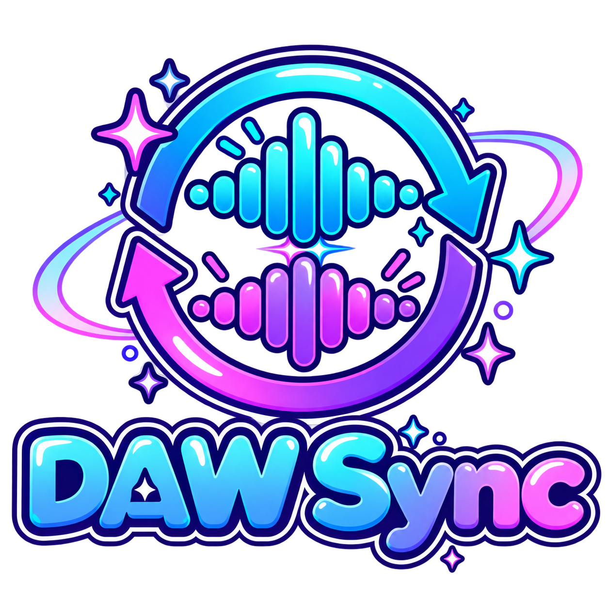
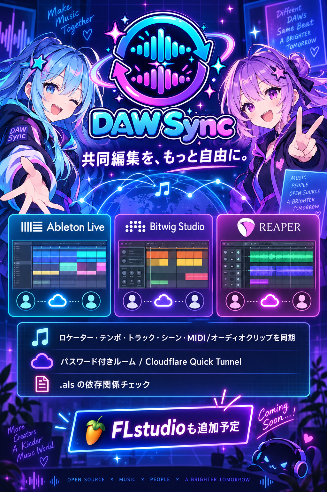

# DAW Sync
[English](README_en.md) / [日本語](README_ja.md)

DAW Sync lets composers work together in real time 
even across different OSs and DAWs 
<b>so you can edit MIDI notes, drop in samples, and share them on the fly.</b>

## Before you use this

 
↑I’m broke and jobless, so please toss me some cash for the ideas

## Features

- Sync locator names and positions, tempo / time-signature changes, tracks, scenes, and MIDI / audio clips
- Edit together from Live, Bitwig, and REAPER
- Password-protected rooms and Cloudflare Quick Tunnel invitations
- `.als` dependency checks for samples, plug-ins, and Packs
- English / Japanese language

Mixer settings (volume, pan, sends, and effects) remain local to each participant. Live's Remote Script API cannot insert Arrangement automation points. DAW Sync applies the effective tempo / time signature at the current position when a map arrives and follows the rows during playback; with Global Record and Automation Arm enabled, Live can record those changes. Saved `.als` tempo envelopes are read and shared after the set is saved.

## Download

[Windows executable](https://github.com/7ewd/dawsync/releases/download/v1.0.2/DawSync.exe) · [Windows zip](https://github.com/7ewd/dawsync/releases/download/v1.0.2/DAW-Sync-windows.zip) · [macOS arm64](https://github.com/7ewd/dawsync/releases/download/v1.0.2/DAW-Sync-osx-arm64.zip) · [macOS x64](https://github.com/7ewd/dawsync/releases/download/v1.0.2/DAW-Sync-osx-x64.zip) · [Linux x64](https://github.com/7ewd/dawsync/releases/download/v1.0.2/DAW-Sync-linux-x64.tar.gz) · [DAW Sync 1.0.2 release](https://github.com/7ewd/dawsync/releases/tag/v1.0.2)

All three builds are self-contained; no .NET installation or additional runtime files are required. The app contains the Live, Bitwig, and REAPER integration files and installs them from the interface.

## Usage

1. Start DAW Sync and create or join a room.
2. Install the integration for your DAW from the app.
3. Share the invite code and collaborate.

When upgrading from Maltese, install the integration again so the renamed DAW Sync scripts are selected by the DAW.

## Tested with

- Ableton Live Suite 12 (12.4.6)
- REAPER v7.81
- Bitwig Studio 6.1

## License

MIT. See [LICENSE](LICENSE).
